# AXI4-Lite Custom Peripheral Design

Vivado의 AXI4-Lite Slave Interface에 I2C / SPI Master IP를 연결하고,  
Vitis에서 작성한 C 코드로 MicroBlaze에서 각 IP를 제어한 프로젝트입니다.

---

## Overview

| 항목 | 내용 |
|:---|:---|
| Language | Verilog, C |
| CPU | MicroBlaze |
| Bus | AMBA AXI4-Lite |
| Peripheral | I2C Master, SPI Master |
| Interface | I2C, SPI |
| Development Environment | Vivado, Vitis |
| FPGA Board | Basys3 |

---

## Contents

- [System Architecture](#system-architecture)
- [AXI4-Lite Interface](#axi4-lite-interface)
  - [AXI4-Lite Protocol](#axi4-lite-protocol)
  - [Write Transfer](#write-transfer)
  - [Read Transfer](#read-transfer)
- [I2C Master](#i2c-master)
  - [I2C Architecture](#i2c-architecture)
  - [I2C Register Map](#i2c-register-map)
  - [I2C Software Architecture](#i2c-software-architecture)
  - [I2C Verification](#i2c-verification)
---

## System Architecture

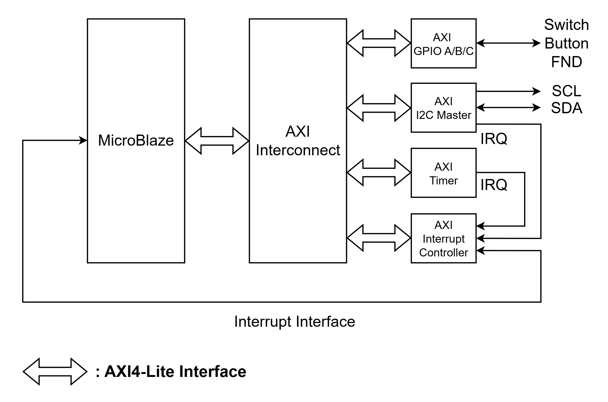

- MicroBlaze 기반 시스템에서 AXI4-Lite를 통해 Memory-Mapped Peripheral의 Register에 접근
- MicroBlaze와 GPIO, Timer, I2C Master, AXI Interrupt Controller는 AXI Interconnect를 통해 연결
- GPIO를 통해 Switch / Button 입력을 읽고 FND 출력 제어
- Timer와 I2C Master에서 발생한 IRQ를 AXI Interrupt Controller에 연결
- Vivado의 AXI Interrupt Controller IP를 통해 Peripheral Interrupt를 MicroBlaze에서 처리
- I2C Master의 `SCL`, `SDA`를 통해 외부 I2C Slave와 통신

## AXI4-Lite Interface

### AXI4-Lite Protocol

AXI4-Lite는 Memory-Mapped Peripheral의 Register 접근에 사용되는 Interface입니다.

본 프로젝트에서는 Vivado에서 생성한 AXI4-Lite Slave Interface를 사용하여 Register와 I2C Master IP를 연결하였습니다.

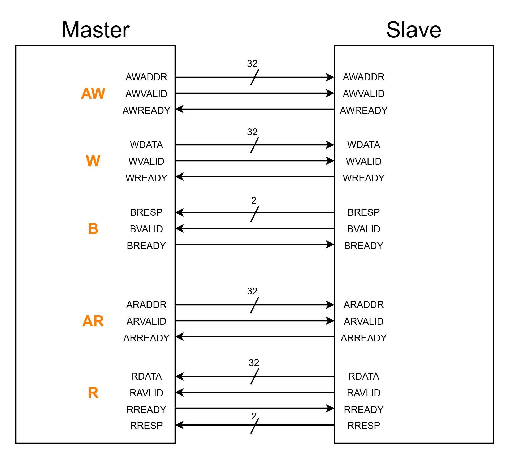

| Channel | 주요 신호 | 설명 |
|:---|:---|:---|
| Write Address | `AWADDR`, `AWVALID`, `AWREADY` | Write Address 전달 |
| Write Data | `WDATA`, `WVALID`, `WREADY` | Write Data 전달 |
| Write Response | `BRESP`, `BVALID`, `BREADY` | Write Response 전달 |
| Read Address | `ARADDR`, `ARVALID`, `ARREADY` | Read Address 전달 |
| Read Data | `RDATA`, `RRESP`, `RVALID`, `RREADY` | Read Data / Response 전달 |

- 각 Channel은 `VALID` / `READY` Handshake를 통해 Transfer 수행
- AXI4-Lite는 Burst Transfer를 지원하지 않으며 Single Transfer 방식으로 동작

### Write Transfer

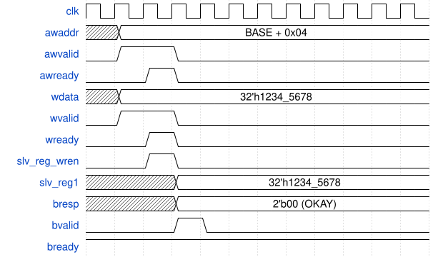

- `AWVALID` / `AWREADY` Handshake를 통해 Write Address 전달
- `WVALID` / `WREADY` Handshake를 통해 Write Data 전달
- Address와 Data가 수신되면 `slv_reg_wren`이 활성화되어 Register Write 수행
- `BVALID` / `BREADY` Handshake를 통해 Write Response 전달

> `slv_reg_wren`은 Vivado AXI4-Lite Slave Interface 내부에서 Register Write 시 사용되는 신호입니다.

### Read Transfer

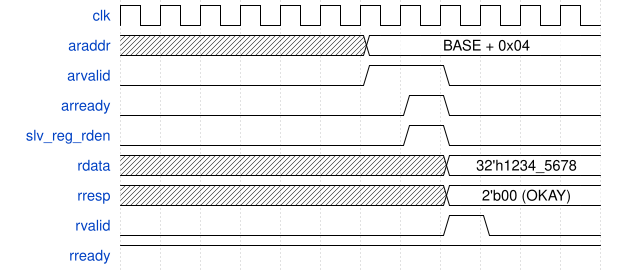

- `ARVALID` / `ARREADY` Handshake를 통해 Read Address 전달
- Address가 수신되면 `slv_reg_rden`이 활성화되어 해당 Register Data 선택
- `RVALID` / `RREADY` Handshake를 통해 Read Data와 Response 전달

> `slv_reg_rden`은 Vivado AXI4-Lite Slave Interface 내부에서 Register Read 시 사용되는 신호입니다.

## I2C Master

### I2C Architecture

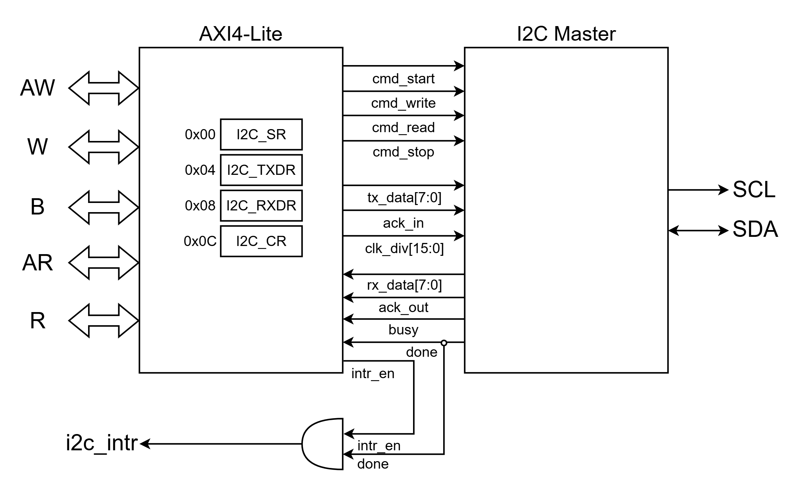

- AXI4-Lite Slave Interface의 Register를 통해 I2C Master 제어
- `CR` Register를 통해 START / WRITE / READ / STOP Command 및 제어값 전달
- `TXDR` / `RXDR` Register를 통해 송수신 Data 전달
- `SR` Register를 통해 BUSY 및 ACK 상태 확인
- I2C Master의 `done`과 `intr_en`을 통해 `i2c_intr` 생성
- `SCL`, `SDA`를 통해 외부 I2C Slave와 통신

### I2C Register Map

| Offset | Register | Bit | Description |
|:---:|:---:|:---|:---|
| `0x00` | `SR` | `[0] BUSY` | I2C Master 동작 상태 |
|  |  | `[1] ACK_OUT` | Slave ACK / NACK 상태 |
| `0x04` | `TXDR` | `[7:0] TX_DATA` | 송신 Data |
| `0x08` | `RXDR` | `[7:0] RX_DATA` | 수신 Data |
| `0x0C` | `CR` | `[0] START` | START Command |
|  |  | `[1] WRITE` | WRITE Command |
|  |  | `[2] READ` | READ Command |
|  |  | `[3] STOP` | STOP Command |
|  |  | `[4] ACK_IN` | Read Data 수신 후 ACK / NACK 설정 |
|  |  | `[5] INTR_EN` | Interrupt Enable |
|  |  | `[23:8] CLK_DIV` | I2C Clock Divider |

- `START`, `WRITE`, `READ`, `STOP` Bit는 Command 실행 시 Pulse 형태로 사용
- `INTR_EN`이 활성화된 상태에서 Command 완료 시 Interrupt 발생

### I2C Software Architecture

Software와 Hardware의 역할을 Application, Driver, HAL, HW의 4개 Layer로 구분하였습니다.

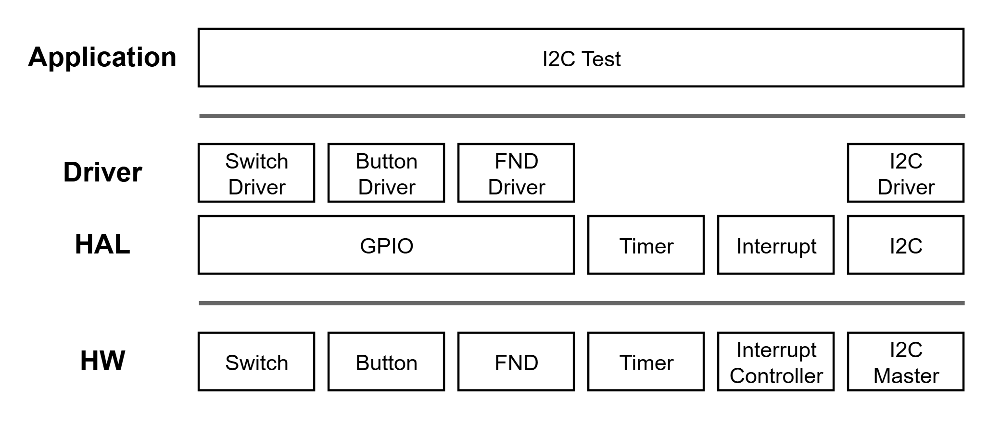

- **Application** : Button / Switch 입력을 기반으로 I2C Write / Read Test 수행
- **Driver** : Switch, Button, FND 및 I2C 동작 제어
- **HAL** : GPIO, Timer, Interrupt, I2C Hardware 접근
- **HW** : Switch, Button, FND, Timer, Interrupt Controller 및 I2C Master

### I2C Verification

#### Simulation

##### I2C Write Simulation

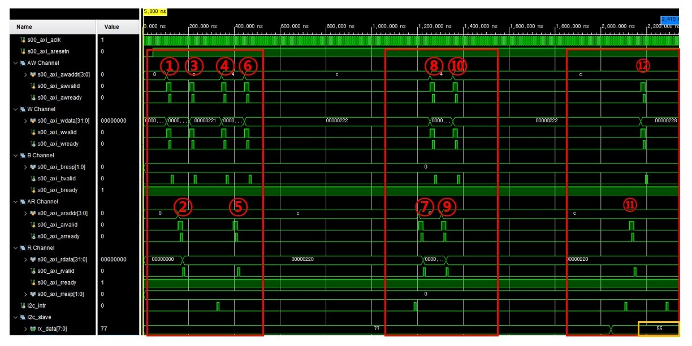

AXI4-Lite Register 접근을 통해 Slave Address `7'h12`에 Data `0x55`를 Write하고, 각 단계의 Handshake를 확인하였습니다.

| 번호 | Register Access | Value | 동작 |
|:---:|:---|:---|:---|
| 1 | `CR` Write | `0x0000_0220` | `CLK_DIV = 2`, `INTR_EN = 1` 설정 |
| 2 | `CR` Read | `0x0000_0220` | 기존 CR 설정값 Read |
| 3 | `CR` Write | `0x0000_0221` | `START` Bit Set → START Command |
| 4 | `TXDR` Write | `0x0000_0024` | Slave Address `7'h12` + Write Bit `0` 저장 |
| 5 | `CR` Read | `0x0000_0220` | 기존 CR 설정값 Read |
| 6 | `CR` Write | `0x0000_0222` | `WRITE` Bit Set → Slave Address 전송 |
| 7 | `SR` Read | `0x0000_0001` | `BUSY = 1`, `ACK_OUT = 0` 확인 |
| 8 | `TXDR` Write | `0x0000_0055` | Write Data `0x55` 저장 |
| 9 | `CR` Read | `0x0000_0220` | 기존 CR 설정값 Read |
| 10 | `CR` Write | `0x0000_0222` | `WRITE` Bit Set → Data `0x55` 전송 |
| 11 | `CR` Read | `0x0000_0220` | 기존 CR 설정값 Read |
| 12 | `CR` Write | `0x0000_0228` | `STOP` Bit Set → Write Transaction 종료 |

> `CR |= Command Bit` 형태로 Command를 설정하므로 기존 `CLK_DIV`, `INTR_EN` 값을 유지하기 위한 Read-Modify-Write가 수행됩니다.

##### I2C Read Simulation

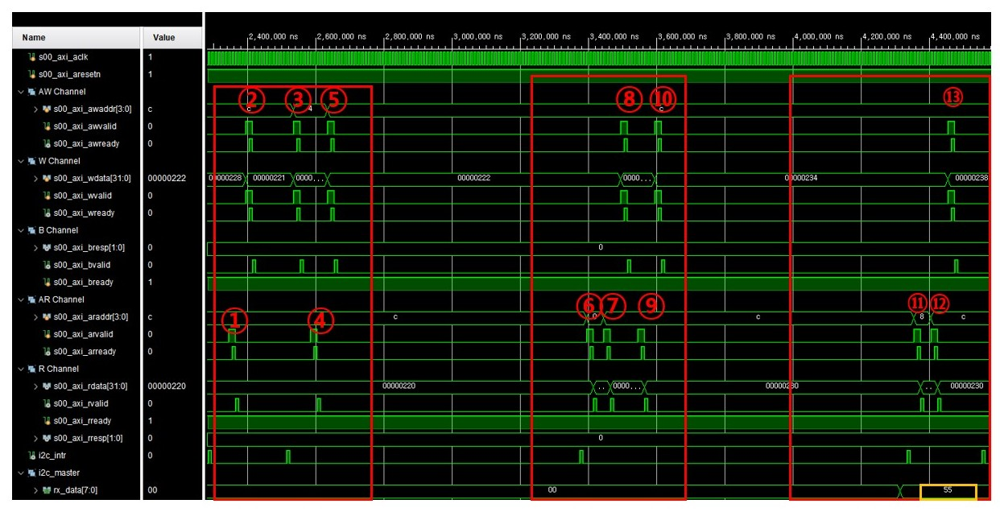

AXI4-Lite Register 접근을 통해 Slave Address `7'h12`로부터 1 Byte Data를 Read하고, 각 단계의 Handshake를 확인하였습니다.

| 번호 | Register Access | Value | 동작 |
|:---:|:---|:---|:---|
| 1 | `CR` Read | `0x0000_0220` | 기존 `CLK_DIV`, `INTR_EN` 설정값 Read |
| 2 | `CR` Write | `0x0000_0221` | `START` Bit Set → START Command 발생 |
| 3 | `TXDR` Write | `0x0000_0025` | Slave Address `7'h12` + Read Bit `1` 저장 |
| 4 | `CR` Read | `0x0000_0220` | 기존 CR 설정값 Read |
| 5 | `CR` Write | `0x0000_0222` | `WRITE` Bit Set → Slave Address + Read 전송 |
| 6 | `SR` Read | `0x0000_0001` | `ACK_OUT = 0`을 확인하여 Slave Address ACK 확인 |
| 7 | `CR` Read | `0x0000_0220` | 기존 CR 설정값 Read |
| 8 | `CR` Write | `0x0000_0230` | `ACK_IN = 1` 설정 → 마지막 Byte 수신 후 NACK 설정 |
| 9 | `CR` Read | `0x0000_0230` | `ACK_IN`이 설정된 CR 값 Read |
| 10 | `CR` Write | `0x0000_0234` | `READ` Bit Set → 1 Byte Data 수신 |
| 11 | `RXDR` Read | `0x0000_0055` | 수신 Data `0x55` 확인 |
| 12 | `CR` Read | `0x0000_0230` | 기존 CR 설정값 Read |
| 13 | `CR` Write | `0x0000_0238` | `STOP` Bit Set → Read Transaction 종료 |

Slave Address는 `7'h12`이며, Read Bit `1`을 포함한 `0x25`를 전송하였습니다.  
1 Byte Read이므로 `ACK_IN = 1`로 설정하여 Data 수신 후 NACK을 전송하고, `RXDR`에서 `0x55`가 정상적으로 수신된 것을 확인하였습니다.

> `START`, `WRITE`, `READ`, `STOP` Command는 `CR |= Command Bit` 형태로 설정하므로 기존 Control Register 값을 유지하기 위한 Read-Modify-Write가 수행됩니다.

#### FPGA Test

I2C Master FPGA와 Slave FPGA를 연결하여 실제 I2C Write / Read 동작을 확인하였습니다.

##### FPGA Operation

- Slave Address : `7'h12`
- Write `0x03` → Read `0x03`
- Write `0x1F` → Read `0x1F`
- Write / Read 완료 후 ACK 상태와 수신 Data 확인
- Read Data를 FND에 출력하여 실제 수신값 확인

https://github.com/user-attachments/assets/ae1e2d9e-f554-4e98-8dd6-002f88803318

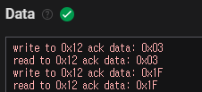

- `0x03` Write 후 동일한 `0x03` Read 확인
- `0x1F` Write 후 동일한 `0x1F` Read 확인
- 각 Write / Read 동작에서 Slave Address `0x12`에 대한 ACK 확인

##### Logic Analyzer

Logic Analyzer를 통해 `SCL`, `SDA` 신호와 실제 I2C Write / Read Transaction을 확인하였습니다.

- Slave Address `0x12`에 `0x03` Write → Address / Data ACK 확인
- Slave Address `0x12`에서 `0x03` Read → Data `0x03` 수신 및 마지막 Byte NACK 확인
- Slave Address `0x12`에 `0x1F` Write → Address / Data ACK 확인
- Slave Address `0x12`에서 `0x1F` Read → Data `0x1F` 수신 및 마지막 Byte NACK 확인

Logic Analyzer 결과 보기

 

**Write `0x03`**

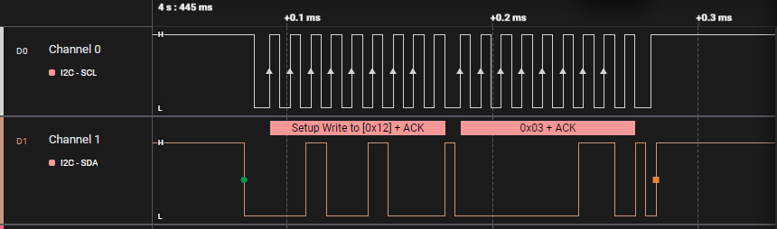

**Read `0x03`**

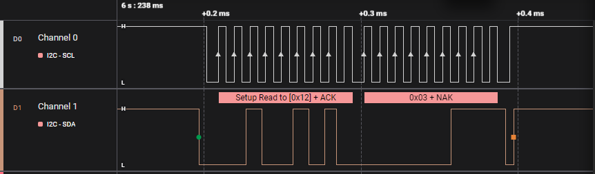

**Write `0x1F`**

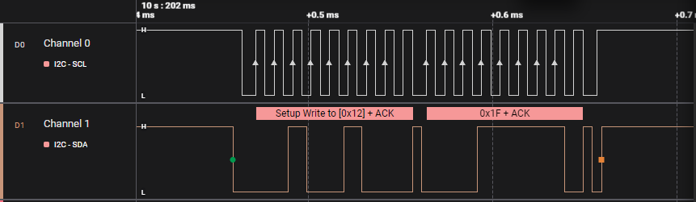

**Read `0x1F`**

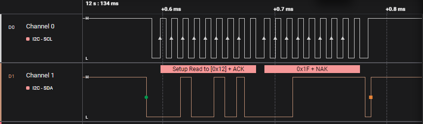

**Write / Read Decode Result (`0x03`)**

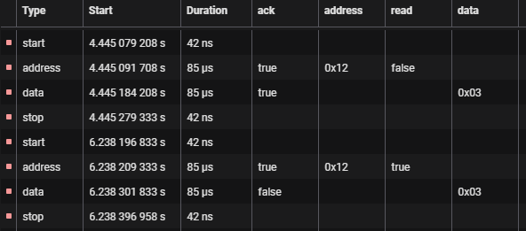

**Write / Read Decode Result (`0x1F`)**

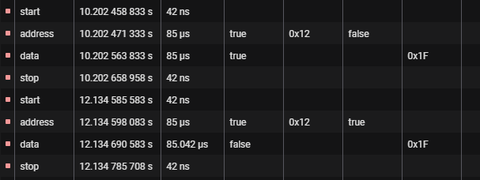

