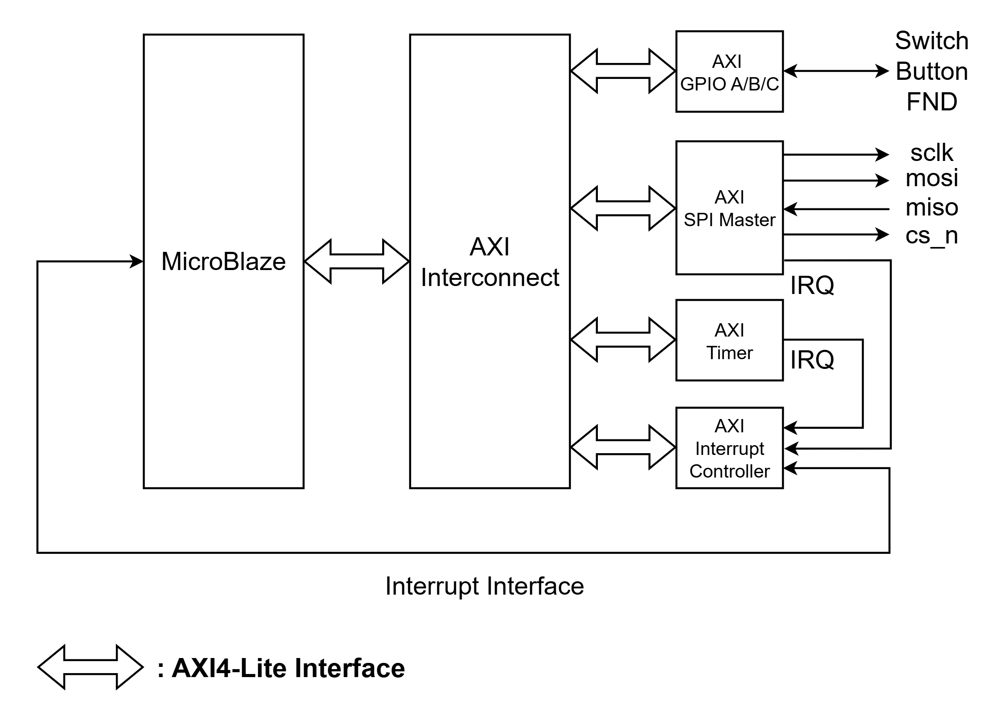
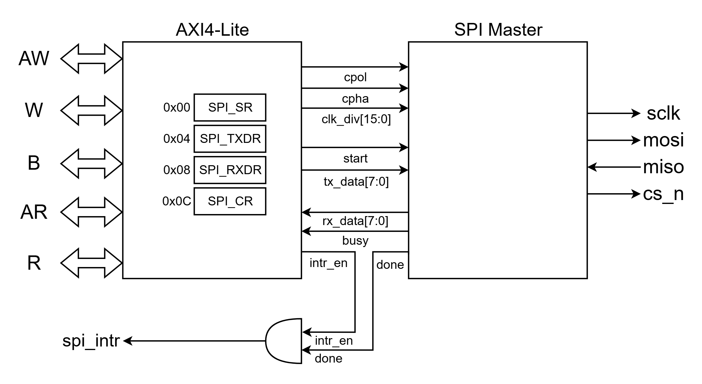
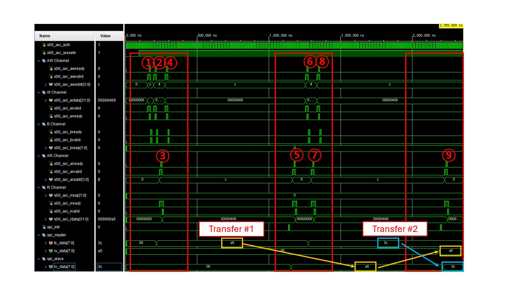
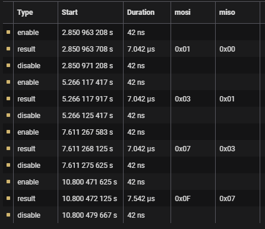
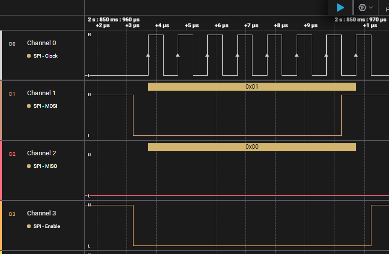
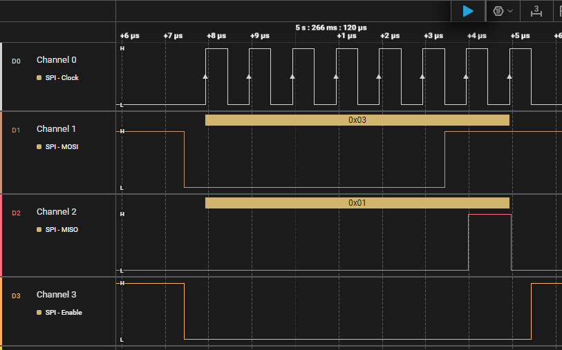
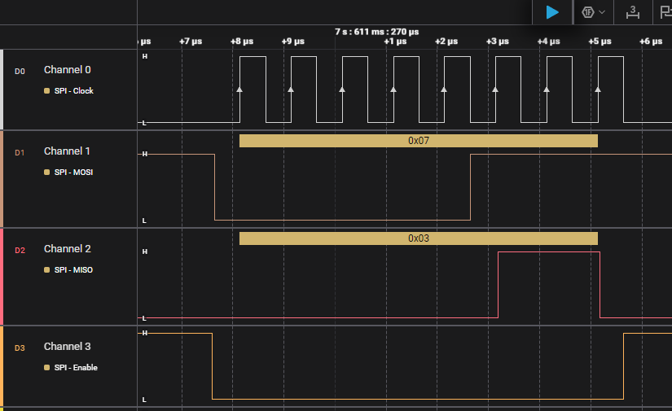
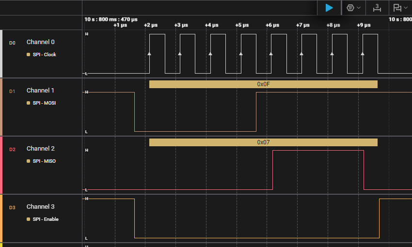

# AXI4-Lite 기반 SPI / I2C Peripheral 설계 및 FPGA 검증

Vivado에서 생성한 AXI4-Lite Slave Interface에 SPI / I2C Master IP를 연결하고,
MicroBlaze에서 C 코드로 각 Peripheral의 Register를 제어한 프로젝트입니다.

Testbench Simulation 및 Master FPGA와 Slave FPGA 간 통신을 통해 Register Access, Interrupt 및 실제 송수신 동작을 검증하였습니다.

---

## Overview

| 항목 | 내용 |
|:---|:---|
| Period | 2026.04.21 ~ 2026.05.07 |
| Language | Verilog, SystemVerilog, C |
| CPU | MicroBlaze |
| Bus | AMBA AXI4-Lite |
| Peripheral | SPI Master, I2C Master |
| Interface | SPI, I2C |
| Development Environment | Vivado 2020.2, Vitis 2020.2 |
| Verification | Testbench Simulation, FPGA Test, Logic Analyzer |
| FPGA Board | Basys3 (Master / Slave) |

---

## Contents

- [System Architecture](#system-architecture)
- [AXI4-Lite Interface](#axi4-lite-interface)
  - [AXI4-Lite Protocol](#axi4-lite-protocol)
  - [Write Transfer](#write-transfer)
  - [Read Transfer](#read-transfer)
- [I2C Master](#i2c-master)
  - [I2C System Architecture](#i2c-system-architecture)
  - [I2C Block Diagram](#i2c-block-diagram)
  - [I2C Register Map](#i2c-register-map)
  - [I2C Software Architecture](#i2c-software-architecture)
  - [I2C Verification](#i2c-verification)
- [SPI Master](#spi-master)
  - [SPI System Architecture](#spi-system-architecture)
  - [SPI Block Diagram](#spi-block-diagram)
  - [SPI Register Map](#spi-register-map)
  - [SPI Software Architecture](#spi-software-architecture)
  - [SPI Verification](#spi-verification)

---

## System Architecture

- MicroBlaze 기반 시스템에서 AXI4-Lite를 통해 Memory-Mapped Peripheral의 Register에 접근
- MicroBlaze와 GPIO, Timer, Custom Peripheral, AXI Interrupt Controller는 AXI Interconnect를 통해 연결
- Custom Peripheral에는 I2C 또는 SPI Master IP를 연결하여 사용
- GPIO를 통해 Switch / Button 입력을 읽고 FND 출력 제어
- Timer와 Custom Peripheral에서 발생한 IRQ를 AXI Interrupt Controller에 연결
- Vivado의 AXI Interrupt Controller IP를 통해 Peripheral Interrupt를 MicroBlaze에서 처리

## AXI4-Lite Interface

### AXI4-Lite Protocol

AXI4-Lite는 Memory-Mapped Peripheral의 Register 접근에 사용되는 Interface입니다.

본 프로젝트에서는 Vivado에서 생성한 AXI4-Lite Slave Interface를 사용하여 Register와 I2C / SPI Master IP를 연결하였습니다.

| Channel | 주요 신호 | 설명 |
|:---|:---|:---|
| Write Address | `AWADDR`, `AWVALID`, `AWREADY` | Write Address 전달 |
| Write Data | `WDATA`, `WVALID`, `WREADY` | Write Data 전달 |
| Write Response | `BRESP`, `BVALID`, `BREADY` | Write Response 전달 |
| Read Address | `ARADDR`, `ARVALID`, `ARREADY` | Read Address 전달 |
| Read Data | `RDATA`, `RRESP`, `RVALID`, `RREADY` | Read Data / Response 전달 |

- 각 Channel은 `VALID` / `READY` Handshake를 통해 Transfer 수행
- AXI4-Lite는 Burst Transfer를 지원하지 않으며 Single Transfer 방식으로 동작

### Write Transfer

- `AWVALID` / `AWREADY` Handshake를 통해 Write Address 전달
- `WVALID` / `WREADY` Handshake를 통해 Write Data 전달
- Address와 Data가 수신되면 `slv_reg_wren`이 활성화되어 Register Write 수행
- `BVALID` / `BREADY` Handshake를 통해 Write Response 전달

> `slv_reg_wren`은 Vivado AXI4-Lite Slave Interface 내부에서 Register Write 시 사용되는 신호입니다.

### Read Transfer

- `ARVALID` / `ARREADY` Handshake를 통해 Read Address 전달
- Address가 수신되면 `slv_reg_rden`이 활성화되어 해당 Register Data 선택
- `RVALID` / `RREADY` Handshake를 통해 Read Data와 Response 전달

> `slv_reg_rden`은 Vivado AXI4-Lite Slave Interface 내부에서 Register Read 시 사용되는 신호입니다.

## I2C Master

### I2C System Architecture

- Custom Peripheral에 I2C Master IP를 연결하여 구성
- `SCL`, `SDA`를 통해 외부 I2C Slave와 통신

### I2C Block Diagram

- AXI4-Lite Slave Interface의 Register를 통해 I2C Master 제어
- `CR` Register를 통해 START / WRITE / READ / STOP Command 및 제어값 전달
- `TXDR` / `RXDR` Register를 통해 송수신 Data 전달
- `SR` Register를 통해 BUSY 및 ACK 상태 확인
- I2C Master의 `done`과 `intr_en`을 통해 `i2c_intr` 생성
- `SCL`, `SDA`를 통해 외부 I2C Slave와 통신

### I2C Register Map

| Offset | Register | Bit | Description |
|:---:|:---:|:---|:---|
| `0x00` | `SR` | `[0] BUSY` | I2C Master 동작 상태 |
|  |  | `[1] ACK_OUT` | Slave ACK / NACK 상태 |
| `0x04` | `TXDR` | `[7:0] TX_DATA` | 송신 Data |
| `0x08` | `RXDR` | `[7:0] RX_DATA` | 수신 Data |
| `0x0C` | `CR` | `[0] START` | START Command |
|  |  | `[1] WRITE` | WRITE Command |
|  |  | `[2] READ` | READ Command |
|  |  | `[3] STOP` | STOP Command |
|  |  | `[4] ACK_IN` | Read Data 수신 후 ACK / NACK 설정 |
|  |  | `[5] INTR_EN` | Interrupt Enable |
|  |  | `[23:8] CLK_DIV` | I2C Clock Divider |

- `START`, `WRITE`, `READ`, `STOP` Bit는 Command 실행 시 Pulse 형태로 사용
- `INTR_EN`이 활성화된 상태에서 Command 완료 시 Interrupt 발생

### I2C Software Architecture

Software와 Hardware의 역할을 Application, Driver, HAL, HW의 4개 Layer로 구분하였습니다.

- **Application** : Button / Switch 입력을 기반으로 I2C Write / Read Test 수행
- **Driver** : Switch, Button, FND 및 I2C 동작 제어
- **HAL** : GPIO, Timer, Interrupt, I2C Hardware 접근
- **HW** : Switch, Button, FND, Timer, Interrupt Controller 및 I2C Master

### I2C Verification

#### Simulation

##### I2C Write Simulation

AXI4-Lite Register 접근을 통해 Slave Address `7'h12`에 Data `0x55`를 Write하고, 각 단계의 Handshake를 확인하였습니다.

| 번호 | Register Access | Value | 동작 |
|:---:|:---|:---|:---|
| 1 | `CR` Write | `0x0000_0220` | `CLK_DIV = 2`, `INTR_EN = 1` 설정 |
| 2 | `CR` Read | `0x0000_0220` | 기존 CR 설정값 Read |
| 3 | `CR` Write | `0x0000_0221` | `START` Bit Set → START Command |
| 4 | `TXDR` Write | `0x0000_0024` | Slave Address `7'h12` + Write Bit `0` 저장 |
| 5 | `CR` Read | `0x0000_0220` | 기존 CR 설정값 Read |
| 6 | `CR` Write | `0x0000_0222` | `WRITE` Bit Set → Slave Address 전송 |
| 7 | `SR` Read | `0x0000_0001` | `BUSY = 1`, `ACK_OUT = 0` 확인 |
| 8 | `TXDR` Write | `0x0000_0055` | Write Data `0x55` 저장 |
| 9 | `CR` Read | `0x0000_0220` | 기존 CR 설정값 Read |
| 10 | `CR` Write | `0x0000_0222` | `WRITE` Bit Set → Data `0x55` 전송 |
| 11 | `CR` Read | `0x0000_0220` | 기존 CR 설정값 Read |
| 12 | `CR` Write | `0x0000_0228` | `STOP` Bit Set → Write Transaction 종료 |

> `CR |= Command Bit` 형태로 Command를 설정하므로 기존 `CLK_DIV`, `INTR_EN` 값을 유지하기 위한 Read-Modify-Write가 수행됩니다.

##### I2C Read Simulation

AXI4-Lite Register 접근을 통해 Slave Address `7'h12`로부터 1 Byte Data를 Read하고, 각 단계의 Handshake를 확인하였습니다.

| 번호 | Register Access | Value | 동작 |
|:---:|:---|:---|:---|
| 1 | `CR` Read | `0x0000_0220` | 기존 `CLK_DIV`, `INTR_EN` 설정값 Read |
| 2 | `CR` Write | `0x0000_0221` | `START` Bit Set → START Command 발생 |
| 3 | `TXDR` Write | `0x0000_0025` | Slave Address `7'h12` + Read Bit `1` 저장 |
| 4 | `CR` Read | `0x0000_0220` | 기존 CR 설정값 Read |
| 5 | `CR` Write | `0x0000_0222` | `WRITE` Bit Set → Slave Address + Read 전송 |
| 6 | `SR` Read | `0x0000_0001` | `ACK_OUT = 0`을 확인하여 Slave Address ACK 확인 |
| 7 | `CR` Read | `0x0000_0220` | 기존 CR 설정값 Read |
| 8 | `CR` Write | `0x0000_0230` | `ACK_IN = 1` 설정 → 마지막 Byte 수신 후 NACK 설정 |
| 9 | `CR` Read | `0x0000_0230` | `ACK_IN`이 설정된 CR 값 Read |
| 10 | `CR` Write | `0x0000_0234` | `READ` Bit Set → 1 Byte Data 수신 |
| 11 | `RXDR` Read | `0x0000_0055` | 수신 Data `0x55` 확인 |
| 12 | `CR` Read | `0x0000_0230` | 기존 CR 설정값 Read |
| 13 | `CR` Write | `0x0000_0238` | `STOP` Bit Set → Read Transaction 종료 |

Slave Address는 `7'h12`이며, Read Bit `1`을 포함한 `0x25`를 전송하였습니다.  
1 Byte Read이므로 `ACK_IN = 1`로 설정하여 Data 수신 후 NACK을 전송하고, `RXDR`에서 `0x55`가 정상적으로 수신된 것을 확인하였습니다.

> `START`, `WRITE`, `READ`, `STOP` Command는 `CR |= Command Bit` 형태로 설정하므로 기존 Control Register 값을 유지하기 위한 Read-Modify-Write가 수행됩니다.

#### FPGA Test

I2C Master FPGA와 Slave FPGA를 연결하여 실제 I2C Write / Read 동작을 확인하였습니다.

##### FPGA Operation

- Slave Address : `7'h12`
- Write `0x03` → Read `0x03`
- Write `0x1F` → Read `0x1F`
- Write / Read 완료 후 ACK 상태와 수신 Data 확인
- Read Data를 FND에 출력하여 실제 수신값 확인

https://github.com/user-attachments/assets/ae1e2d9e-f554-4e98-8dd6-002f88803318

##### Logic Analyzer

Logic Analyzer를 통해 `SCL`, `SDA` 신호와 실제 I2C Write / Read Transaction을 확인하였습니다.

- Slave Address `0x12`에 `0x03` Write → Address / Data ACK 확인
- Slave Address `0x12`에서 `0x03` Read → Data `0x03` 수신 및 마지막 Byte NACK 확인
- Slave Address `0x12`에 `0x1F` Write → Address / Data ACK 확인
- Slave Address `0x12`에서 `0x1F` Read → Data `0x1F` 수신 및 마지막 Byte NACK 확인

**Write / Read Decode Result (`0x03`)**

**Write / Read Decode Result (`0x1F`)**

상세 파형 보기

 

**Write `0x03`**

**Read `0x03`**

**Write `0x1F`**

**Read `0x1F`**

## SPI Master

### SPI System Architecture

- Custom Peripheral에 SPI Master IP를 연결하여 구성
- MicroBlaze에서 AXI4-Lite를 통해 SPI Master의 Register에 접근
- `SCLK`, `MOSI`, `MISO`, `CS_n`을 통해 외부 SPI Slave와 Full-Duplex 통신
- SPI Master에서 발생한 Interrupt를 AXI Interrupt Controller를 통해 MicroBlaze에서 처리

### SPI Block Diagram

- AXI4-Lite Slave Interface의 Register를 통해 SPI Master 제어
- `CR` Register를 통해 START, CPOL, CPHA, Interrupt Enable 및 Clock Divider 설정
- `TXDR` / `RXDR` Register를 통해 송수신 Data 전달
- `SR` Register를 통해 BUSY 상태 확인
- SPI Master의 `done`과 `intr_en`을 통해 `spi_intr` 생성
- `SCLK`, `MOSI`, `MISO`, `CS_n`을 통해 외부 SPI Slave와 통신

### SPI Register Map

| Offset | Register | Bit | Description |
|:---:|:---:|:---|:---|
| `0x00` | `SR` | `[0] BUSY` | SPI Master 동작 상태 |
| `0x04` | `TXDR` | `[7:0] TX_DATA` | 송신 Data |
| `0x08` | `RXDR` | `[7:0] RX_DATA` | 수신 Data |
| `0x0C` | `CR` | `[0] START` | SPI Transfer Start Command |
|  |  | `[1] CPOL` | Clock Polarity 설정 |
|  |  | `[2] CPHA` | Clock Phase 설정 |
|  |  | `[3] INTR_EN` | Interrupt Enable |
|  |  | `[23:8] CLK_DIV` | SPI Clock Divider |

- `START` Bit는 SPI Transfer 시작 시 Pulse 형태로 사용
- `CPOL`, `CPHA` 설정을 통해 SPI Mode 설정
- `INTR_EN`이 활성화된 상태에서 SPI Transfer 완료 시 Interrupt 발생
- `CLK_DIV` 값에 따라 `SCLK` 주파수 설정
- `SCLK` 주파수는 `f_clk / (2 × (CLK_DIV + 1))`로 설정

### SPI Software Architecture

Software와 Hardware의 역할을 Application, Driver, HAL, HW의 4개 Layer로 구분하였습니다.

- **Application** : Button / Switch 입력을 기반으로 SPI Transfer Test 수행
- **Driver** : Switch, Button, FND 및 SPI Transfer 동작 제어
- **HAL** : GPIO, Timer, Interrupt, SPI Hardware 접근
- **HW** : Switch, Button, FND, Timer, Interrupt Controller 및 SPI Master

### SPI Verification

#### Simulation

AXI4-Lite Register 접근을 통해 SPI Mode 0에서 1 Byte Full-Duplex Transfer를 수행하고, Register 접근과 송수신 Data를 확인하였습니다.

| 번호 | Register Access | Value | 동작 |
|:---:|:---|:---|:---|
| 1 | `CR` Write | `0x0000_0408` | `CLK_DIV = 4`, `INTR_EN = 1`, Mode 0 설정 |
| 2 | `TXDR` Write | `0x0000_00A5` | 첫 번째 송신 Data `0xA5` 저장 |
| 3 | `CR` Read | `0x0000_0408` | 기존 CR 설정값 Read |
| 4 | `CR` Write | `0x0000_0409` | `START` Bit Set → 첫 번째 SPI Transfer 시작 |
| 5 | `RXDR` Read | `0x0000_0000` | 첫 번째 수신 Data `0x00` 확인 |
| 6 | `TXDR` Write | `0x0000_003C` | 두 번째 송신 Data `0x3C` 저장 |
| 7 | `CR` Read | `0x0000_0408` | 기존 CR 설정값 Read |
| 8 | `CR` Write | `0x0000_0409` | `START` Bit Set → 두 번째 SPI Transfer 시작 |
| 9 | `RXDR` Read | `0x0000_00A5` | 두 번째 수신 Data `0xA5` 확인 |

> `CR |= START` 형태로 Transfer를 시작하므로 기존 `CLK_DIV`, `INTR_EN`, `CPOL`, `CPHA` 설정값을 유지하기 위한 Read-Modify-Write가 수행됩니다.

SPI는 Full-Duplex 방식으로 동작하므로 MOSI를 통한 송신과 MISO를 통한 수신이 동시에 수행됩니다.

| Transfer | Master TX | Slave RX | Master RX |
|:---:|:---:|:---:|:---:|
| #1 | `0xA5` | `0xA5` | `0x00` |
| #2 | `0x3C` | `0x3C` | `0xA5` |

첫 번째 Transfer에서는 Slave의 초기 Data가 `0x00`이므로 Master가 `0x00`을 수신하였습니다.  
Slave는 Master가 전송한 `0xA5`를 저장하고, 두 번째 Transfer에서 해당 Data를 MISO를 통해 전송하므로 Master에서 `0xA5`가 수신된 것을 확인하였습니다.

각 Transfer 완료 시 `spi_intr`이 발생하여 SPI Transfer 완료를 확인하였습니다.

#### FPGA Test

SPI Master FPGA와 Slave FPGA를 연결하여 실제 SPI Full-Duplex 통신을 확인하였습니다.

##### FPGA Operation

- SPI Mode : Mode 0 (`CPOL = 0`, `CPHA = 0`)
- Slave 초기 Data : `0x00`
- Switch 값을 Master의 송신 Data로 설정하고 Button 입력 시 SPI Transfer 수행
- Slave는 수신한 Data를 저장하고, 다음 Transfer에서 이전 수신 Data를 MISO를 통해 전송
- Master / Slave의 수신 Data를 FND에 출력하여 실제 송수신값 확인

| Transfer | Master TX | Master RX | Slave RX |
|:---:|:---:|:---:|:---:|
| #1 | `0x01` | `0x00` | `0x01` |
| #2 | `0x03` | `0x01` | `0x03` |
| #3 | `0x07` | `0x03` | `0x07` |
| #4 | `0x0F` | `0x07` | `0x0F` |

https://github.com/user-attachments/assets/896fdaae-3cfa-455f-a7ca-9e6a758ba4ba

##### Logic Analyzer

Logic Analyzer를 통해 `SCLK`, `MOSI`, `MISO`, `CS_n` 신호와 SPI Mode 0의 Full-Duplex Transfer를 확인하였습니다.

- `CS_n`이 Low인 동안 8개의 `SCLK`를 통해 1 Byte Data 송수신
- MOSI를 통해 Master의 송신 Data가 Slave에 전달되는 것을 확인
- MISO를 통해 Slave에 저장된 이전 Data가 Master로 전달되는 것을 확인
- 연속 Transfer에서 `0x01 → 0x03 → 0x07 → 0x0F`를 송신하고 각 수신 Data 확인

**Decode Result**

상세 파형 보기

 

**Transfer #1 : Master TX `0x01` / Master RX `0x00`**

**Transfer #2 : Master TX `0x03` / Master RX `0x01`**

**Transfer #3 : Master TX `0x07` / Master RX `0x03`**

**Transfer #4 : Master TX `0x0F` / Master RX `0x07`**

